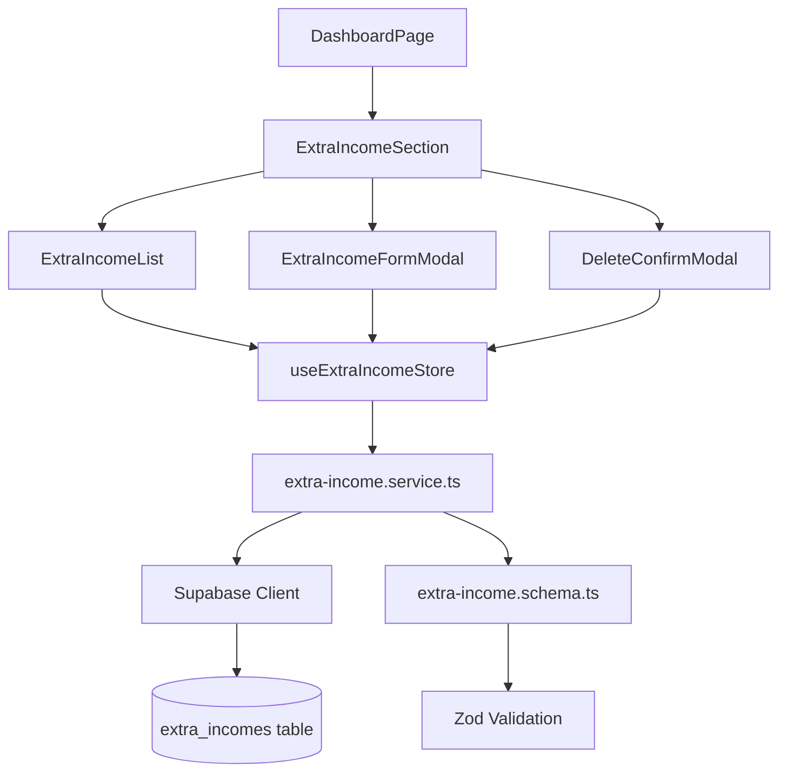

# Documento de Design: Ganhos Extras Mensais

## Visão Geral

Esta feature implementa o gerenciamento completo de ganhos extras mensais (CRUD) no planejador financeiro, permitindo ao usuário registrar rendimentos pontuais como 13° salário, férias, bonificações, PLR e horas extras. Os ganhos extras são vinculados a um mês/ano específico e somados ao saldo real do dashboard.

A implementação segue os padrões já estabelecidos no projeto:
- **Service layer** com validação Zod e operações Supabase (`extra-income.service.ts`)
- **Zustand store** com atualização otimista e rollback em caso de erro (`extra-income.store.ts`)
- **Zod schema** para validação de formulário (`extra-income.schema.ts`)
- **Componentes React** reutilizando Modal, Input, Button e Toast existentes

A tabela `extra_incomes` já existe no banco de dados com RLS configurado, então nenhuma migração é necessária.

## Arquitetura

A feature segue a arquitetura em camadas já utilizada no projeto:



**Fluxo de dados:**
1. O `DashboardPage` renderiza o `ExtraIncomeSection` passando `month`, `year` e `profileId`
2. O `ExtraIncomeSection` usa o `useExtraIncomeStore` para buscar/gerenciar ganhos extras
3. O store chama o service para operações CRUD
4. O service valida dados com Zod e comunica com Supabase
5. O store atualiza o estado local otimisticamente, com rollback em caso de erro

## Componentes e Interfaces

### 1. `ExtraIncomeSection` (componente container)

Componente principal que orquestra a seção de ganhos extras dentro do Dashboard.

```typescript
interface ExtraIncomeSectionProps {
  profileId: string
  month: number
  year: number
}
```

**Responsabilidades:**
- Renderiza o cabeçalho da seção com título "Ganhos Extras" e botão de adicionar
- Renderiza a `ExtraIncomeList`
- Gerencia abertura/fechamento dos modais de formulário e exclusão
- Exibe toast de sucesso/erro via `useToast`

### 2. `ExtraIncomeList` (componente de apresentação)

Exibe a lista de ganhos extras do mês selecionado.

```typescript
interface ExtraIncomeListProps {
  incomes: ExtraIncome[]
  onEdit: (income: ExtraIncome) => void
  onDelete: (income: ExtraIncome) => void
}
```

**Responsabilidades:**
- Renderiza cada ganho extra com descrição e valor formatado (R$)
- Exibe botões de editar e excluir em cada item
- Exibe mensagem "Nenhum ganho extra cadastrado" quando a lista está vazia
- Exibe o total de ganhos extras do mês

### 3. `ExtraIncomeFormModal` (componente de formulário)

Modal para criação e edição de ganhos extras, reutilizando o componente `Modal` existente.

```typescript
interface ExtraIncomeFormModalProps {
  isOpen: boolean
  onClose: () => void
  onSubmit: (data: ExtraIncomeFormData) => Promise<void>
  initialData?: ExtraIncome | null
}
```

**Responsabilidades:**
- Campos: descrição (texto) e valor (moeda)
- Validação inline com mensagens de erro nos campos
- Modo criação (campos vazios) e edição (campos preenchidos)
- Botão de salvar com estado de loading

### 4. `useExtraIncomeStore` (Zustand store)

```typescript
interface ExtraIncomeState {
  extraIncomes: ExtraIncome[]
  loading: boolean
  fetchExtraIncomes: (userId: string, month: number, year: number) => Promise<void>
  addExtraIncome: (userId: string, data: ExtraIncomeFormData, month: number, year: number) => Promise<void>
  updateExtraIncome: (id: string, data: ExtraIncomeFormData) => Promise<void>
  removeExtraIncome: (id: string) => Promise<void>
}
```

**Padrão de rollback (seguindo `expenses.store.ts`):**
- `removeExtraIncome`: remove otimisticamente da lista, restaura em caso de erro
- `updateExtraIncome`: atualiza otimisticamente, reverte ao estado anterior em caso de erro
- `addExtraIncome`: adiciona ao estado local após sucesso do service

### 5. `extra-income.service.ts` (camada de serviço)

```typescript
// Seguindo o padrão de expenses.service.ts
function listExtraIncomes(userId: string, month: number, year: number): Promise<ExtraIncome[]>
function createExtraIncome(userId: string, data: ExtraIncomeFormData, month: number, year: number): Promise<ExtraIncome>
function updateExtraIncome(id: string, data: ExtraIncomeFormData): Promise<ExtraIncome>
function deleteExtraIncome(id: string): Promise<void>
```

**Detalhes:**
- `listExtraIncomes`: filtra por `user_id` e intervalo de datas do mês (primeiro ao último dia)
- `createExtraIncome`: valida com Zod, define `data` como o primeiro dia do mês selecionado
- `updateExtraIncome`: atualiza descrição e valor
- `deleteExtraIncome`: remove o registro pelo id
- Todas as funções lançam `Error` em caso de falha do Supabase

### 6. `extra-income.schema.ts` (validação Zod)

```typescript
const extraIncomeSchema = z.object({
  descricao: z.string()
    .min(1, 'Descrição é obrigatória')
    .max(255, 'Descrição deve ter no máximo 255 caracteres'),
  valor: z.number()
    .positive('Valor deve ser positivo'),
})

type ExtraIncomeFormData = z.infer<typeof extraIncomeSchema>
```

## Modelos de Dados

### Tabela existente: `extra_incomes`

| Coluna     | Tipo          | Restrições                          |
|------------|---------------|-------------------------------------|
| id         | UUID          | PK, default gen_random_uuid()       |
| user_id    | UUID          | FK → user_profiles(id), NOT NULL    |
| descricao  | VARCHAR(255)  | NOT NULL                            |
| valor      | NUMERIC(12,2) | NOT NULL, CHECK (valor > 0)         |
| data       | DATE          | NOT NULL                            |
| created_at | TIMESTAMPTZ   | NOT NULL, default now()             |

### Tipo TypeScript existente: `ExtraIncome`

```typescript
interface ExtraIncome {
  id: string
  user_id: string
  descricao: string
  valor: number
  data: string       // formato YYYY-MM-DD
  created_at: string
}
```

### Tipo do formulário: `ExtraIncomeFormData`

```typescript
interface ExtraIncomeFormData {
  descricao: string
  valor: number
}
```

### Integração com o Dashboard

O cálculo do saldo real no `DashboardPage` será atualizado:

```
Saldo Real = salário líquido + Σ(ganhos extras do mês) - Σ(despesas pessoais do mês)
```

O card de saldo exibirá um mini-card adicional "Extras" mostrando o total de ganhos extras, seguindo o mesmo padrão visual dos mini-cards "Ganho" e "Despesas" existentes.


## Propriedades de Corretude

*Uma propriedade é uma característica ou comportamento que deve ser verdadeiro em todas as execuções válidas de um sistema — essencialmente, uma declaração formal sobre o que o sistema deve fazer. Propriedades servem como ponte entre especificações legíveis por humanos e garantias de corretude verificáveis por máquina.*

### Propriedade 1: Validação do schema aceita dados válidos e rejeita inválidos

*Para qualquer* string `descricao` com comprimento entre 1 e 255 caracteres e qualquer número `valor` positivo (> 0), o schema Zod `extraIncomeSchema` deve aceitar os dados. *Para qualquer* string vazia ou com mais de 255 caracteres, ou qualquer valor ≤ 0, o schema deve rejeitar os dados com erro de validação.

**Valida: Requisitos 2.4, 2.5**

### Propriedade 2: Adicionar ganho extra aumenta a lista

*Para qualquer* lista de `ExtraIncome` e qualquer novo `ExtraIncome` válido, após a adição, a lista deve conter o novo item e seu comprimento deve ser exatamente 1 a mais que o comprimento anterior.

**Valida: Requisitos 2.3**

### Propriedade 3: Remover ganho extra diminui a lista

*Para qualquer* lista não-vazia de `ExtraIncome` e qualquer item presente na lista, após a remoção, a lista não deve conter o item removido e seu comprimento deve ser exatamente 1 a menos que o comprimento anterior.

**Valida: Requisitos 4.3**

### Propriedade 4: Atualizar ganho extra reflete as alterações

*Para qualquer* lista de `ExtraIncome` contendo um item e quaisquer novos valores válidos de `descricao` e `valor`, após a atualização, o item na lista deve ter os novos valores e todos os outros itens devem permanecer inalterados.

**Valida: Requisitos 3.3**

### Propriedade 5: Cálculo do saldo real

*Para qualquer* salário líquido (≥ 0), qualquer lista de ganhos extras (cada valor > 0) e qualquer lista de despesas (cada valor > 0), o saldo real deve ser igual a: `salário + Σ(ganhos_extras.valor) - Σ(despesas.valor)`.

**Valida: Requisitos 5.1**

### Propriedade 6: Rollback no store após falha na atualização

*Para qualquer* estado inicial do store contendo uma lista de `ExtraIncome` e qualquer tentativa de atualização que falhe no service, o store deve reverter ao estado exatamente anterior à tentativa de atualização.

**Valida: Requisitos 6.2**

### Propriedade 7: Rollback no store após falha na exclusão

*Para qualquer* estado inicial do store contendo uma lista de `ExtraIncome` e qualquer tentativa de exclusão que falhe no service, o store deve restaurar o item removido e retornar ao estado exatamente anterior à tentativa de exclusão.

**Valida: Requisitos 6.3**

## Tratamento de Erros

### Erros de Validação (Client-side)

| Cenário | Comportamento |
|---------|---------------|
| Descrição vazia | Exibe "Descrição é obrigatória" abaixo do campo |
| Descrição > 255 caracteres | Exibe "Descrição deve ter no máximo 255 caracteres" |
| Valor ≤ 0 ou não numérico | Exibe "Valor deve ser positivo" abaixo do campo |

A validação é feita pelo Zod schema antes de enviar ao service. O formulário exibe erros inline nos campos correspondentes usando `aria-invalid` e `aria-describedby` para acessibilidade.

### Erros de Rede/Supabase (Server-side)

| Operação | Comportamento |
|----------|---------------|
| Falha ao buscar (fetch) | Toast de erro; mantém estado anterior ou exibe mensagem de erro na lista |
| Falha ao criar (create) | Toast de erro; estado do store inalterado (não faz update otimista na criação) |
| Falha ao atualizar (update) | Toast de erro; store reverte ao estado anterior (rollback) |
| Falha ao excluir (delete) | Toast de erro; store restaura o item na lista (rollback) |

**Padrão de rollback** (seguindo `expenses.store.ts`):
1. Salvar snapshot do estado atual
2. Aplicar mudança otimista no store
3. Chamar o service
4. Em caso de erro: restaurar snapshot e lançar o erro para o componente exibir toast

### Erros de Autenticação

Se o usuário não estiver autenticado, as políticas RLS do Supabase retornarão erro. O `ProtectedRoute` no `App.tsx` já garante que apenas usuários autenticados acessem o dashboard.

## Estratégia de Testes

### Testes Unitários (example-based)

- **Schema**: Casos específicos de validação (string vazia, string no limite de 255, valor zero, valor negativo)
- **Service**: Mock do Supabase para verificar chamadas corretas (insert com user_id, select com filtro de data, update, delete)
- **Componentes**: Renderização da lista vazia, lista com itens, abertura de modal, preenchimento de formulário, exibição de erros

### Testes de Propriedade (property-based com fast-check)

O projeto já utiliza `fast-check` como dependência de desenvolvimento. Cada propriedade de corretude será implementada como um teste de propriedade com mínimo de 100 iterações.

| Propriedade | Arquivo de Teste | Tag |
|-------------|-----------------|-----|
| 1: Validação do schema | `src/schemas/extra-income.schema.test.ts` | Feature: extra-monthly-income, Property 1: Schema validation |
| 2: Adicionar aumenta lista | `src/stores/extra-income.store.test.ts` | Feature: extra-monthly-income, Property 2: Add grows list |
| 3: Remover diminui lista | `src/stores/extra-income.store.test.ts` | Feature: extra-monthly-income, Property 3: Remove shrinks list |
| 4: Atualizar reflete mudanças | `src/stores/extra-income.store.test.ts` | Feature: extra-monthly-income, Property 4: Update reflects changes |
| 5: Cálculo do saldo | `src/lib/balance.test.ts` | Feature: extra-monthly-income, Property 5: Balance calculation |
| 6: Rollback na atualização | `src/stores/extra-income.store.test.ts` | Feature: extra-monthly-income, Property 6: Update rollback |
| 7: Rollback na exclusão | `src/stores/extra-income.store.test.ts` | Feature: extra-monthly-income, Property 7: Delete rollback |

**Configuração dos testes de propriedade:**
- Biblioteca: `fast-check` (já instalada)
- Runner: `vitest` (já configurado)
- Mínimo de iterações: 100 por propriedade
- Cada teste referencia a propriedade do documento de design via tag no comentário

### Testes de Integração

- Verificar que a mudança de mês dispara nova busca com parâmetros corretos
- Verificar que o dashboard recalcula o saldo quando o store muda
- Verificar que o user_id é enviado nas operações de criação
