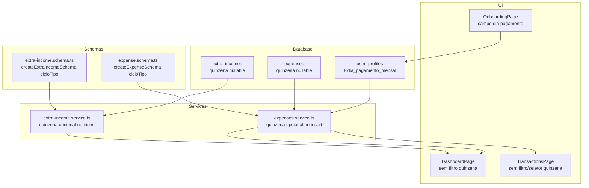

# Design — Perfil de Pagamento Mensal

## Overview

Esta feature adapta o aplicativo de planejamento financeiro para suportar plenamente usuários com ciclo de pagamento mensal (`ciclo_tipo = 'mensal'`). Atualmente, toda a lógica de dados e UI é construída em torno do conceito de "quinzena" (dois pagamentos por mês). Usuários mensais precisam de uma experiência sem seletores/filtros de quinzena, com onboarding simplificado e cálculos de saldo usando o salário completo.

### Decisões de Design

1. **Schemas Zod condicionais**: Em vez de criar schemas separados, usaremos funções factory que recebem `cicloTipo` e retornam o schema adequado. Isso mantém a validação centralizada e evita duplicação.
2. **Migração aditiva**: A coluna `quinzena` nas tabelas `expenses` e `extra_incomes` será alterada para aceitar NULL (DROP NOT NULL + ajuste do CHECK). Dados existentes permanecem intactos.
3. **Hook `useProfile` como fonte de verdade**: O `ciclo_tipo` do perfil, já disponível via `useProfile()`, será usado em todas as telas para decidir o que mostrar/esconder. Nenhum novo store é necessário.
4. **Reutilização de componentes existentes**: Todas as adaptações usam os componentes UI existentes (Modal, Input, Select) com inline styles, sem introduzir novos padrões.

## Architecture

A feature impacta 4 camadas da aplicação:



### Fluxo de Dados

1. **Onboarding**: Usuário seleciona "Mensal" → informa dia do pagamento → salva `ciclo_tipo='mensal'`, `dia_pagamento_mensal=N`, `quinzena_1_valor=0`, `quinzena_2_valor=0`
2. **Dashboard**: `useProfile()` retorna `ciclo_tipo` → se `'mensal'`, esconde filtros de quinzena, usa `salario_liquido` direto, soma todos os extras sem filtro de quinzena
3. **Despesas**: `ciclo_tipo` determina se o campo quinzena aparece nos modais e se o filtro de quinzena é exibido
4. **Schemas**: Funções factory `createExpenseSchema(cicloTipo)` e `createExtraIncomeSchema(cicloTipo)` retornam schemas com quinzena obrigatória ou opcional

## Components and Interfaces

### 1. Migração SQL (`008_monthly_profile.sql`)

```sql
-- Adicionar coluna dia_pagamento_mensal
ALTER TABLE user_profiles
  ADD COLUMN dia_pagamento_mensal INTEGER CHECK (
    dia_pagamento_mensal IS NULL OR (dia_pagamento_mensal BETWEEN 1 AND 31)
  );

-- Tornar quinzena nullable em expenses
ALTER TABLE expenses DROP CONSTRAINT IF EXISTS expenses_quinzena_check;
ALTER TABLE expenses ALTER COLUMN quinzena DROP NOT NULL;
ALTER TABLE expenses ADD CONSTRAINT expenses_quinzena_check
  CHECK (quinzena IS NULL OR quinzena IN ('1', '2'));

-- Tornar quinzena nullable em extra_incomes
ALTER TABLE extra_incomes DROP CONSTRAINT IF EXISTS extra_incomes_quinzena_check;
ALTER TABLE extra_incomes ALTER COLUMN quinzena DROP NOT NULL;
ALTER TABLE extra_incomes ADD CONSTRAINT extra_incomes_quinzena_check
  CHECK (quinzena IS NULL OR quinzena IN ('1', '2'));
```

### 2. Schema Factory — `expense.schema.ts`

```typescript
// Nova função factory
export function createExpenseSchema(cicloTipo: string) {
  const base = {
    descricao: z.string().min(1).max(255),
    valor: z.number().positive(),
    categoria: z.enum(EXPENSE_CATEGORIES),
    data_vencimento: z.string().min(1).regex(/^\d{4}-\d{2}-\d{2}$/),
    status: z.enum(['paid', 'pending']),
    recorrente: z.boolean().optional().default(false),
  }

  if (cicloTipo === 'mensal') {
    return z.object({
      ...base,
      quinzena: z.enum(['1', '2']).nullish(), // opcional para mensal
    })
  }

  return z.object({
    ...base,
    quinzena: z.enum(['1', '2']), // obrigatório para quinzenal
  })
}

// Manter expenseSchema existente para compatibilidade
export const expenseSchema = createExpenseSchema('15_ultimo')
```

### 3. Schema Factory — `extra-income.schema.ts`

```typescript
export function createExtraIncomeSchema(cicloTipo: string) {
  const base = {
    descricao: z.string().min(1).max(255),
    valor: z.number().positive(),
  }

  if (cicloTipo === 'mensal') {
    return z.object({
      ...base,
      quinzena: z.enum(['1', '2']).nullish(),
    })
  }

  return z.object({
    ...base,
    quinzena: z.enum(['1', '2']),
  })
}

export const extraIncomeSchema = createExtraIncomeSchema('15_ultimo')
```

### 4. Tipo `UserProfile` — `types/index.ts`

```typescript
export interface UserProfile {
  // ... campos existentes ...
  dia_pagamento_mensal: number | null  // novo campo
}
```

Também atualizar `Expense` e `ExtraIncome` para aceitar `quinzena` nullable:

```typescript
export interface Expense {
  // ...
  quinzena: Quinzena | null  // era Quinzena
}

export interface ExtraIncome {
  // ...
  quinzena: Quinzena | null  // era Quinzena
}
```

### 5. Utilitário `filterByQuinzena` — `lib/quinzena.ts`

```typescript
export function filterByQuinzena<T extends { quinzena: Quinzena | null }>(
  items: T[],
  filter: 'all' | Quinzena,
): T[] {
  if (filter === 'all') return items
  return items.filter((item) => item.quinzena === filter)
}
```

Items com `quinzena === null` são incluídos quando `filter === 'all'` (já funciona) e excluídos quando o filtro é `'1'` ou `'2'` (já funciona, pois `null !== '1'`).

### 6. Helper `isMensal`

Adicionar um helper simples para evitar comparações de string espalhadas:

```typescript
// lib/quinzena.ts
export function isMensal(cicloTipo: string | undefined): boolean {
  return cicloTipo === 'mensal'
}
```

### 7. OnboardingPage — Adaptações

- Quando `ciclo === 'mensal'`:
  - Mostrar campo numérico "Dia do pagamento" (1–31) no step 1
  - Esconder sub-opções de quinzena ("Dia 15 e Último dia útil", "5º dia útil e Dia 20")
  - No step 2: mostrar apenas "Salário bruto" e "Salário líquido", esconder campos de quinzena
  - No `handleFinish`: salvar `ciclo_tipo='mensal'`, `dia_pagamento_mensal=dia`, `quinzena_1_valor=0`, `quinzena_2_valor=0`

### 8. DashboardPage — Adaptações

- Quando `isMensal(profile?.ciclo_tipo)`:
  - Esconder pills de filtro de quinzena
  - Forçar `quinzenaFilter = 'all'` (sem possibilidade de filtrar por quinzena)
  - Income = `salario_liquido` direto (ignorar `quinzena_1_valor` e `quinzena_2_valor`)
  - `totalExtraIncomes` = soma de todos os extras (sem filtro de quinzena)
  - No modal de edição de renda: mostrar campo único "Salário líquido" em vez de dois campos de quinzena
  - No formulário inline de extra income: esconder seletor de quinzena
  - Na lista de extras: esconder badge "Q1"/"Q2"

### 9. TransactionsPage — Adaptações

- Quando `isMensal(profile?.ciclo_tipo)`:
  - Esconder pills de filtro de quinzena
  - Esconder campo "Quinzena" nos modais de adicionar e editar despesa
  - No submit: não incluir `quinzena` no form data (será null no DB)

### 10. Services — Adaptações

- `expenses.service.ts`: `createExpense` e `updateExpense` já aceitam os dados validados pelo schema. Como o schema mensal permite `quinzena` como null/undefined, o insert enviará null para o DB.
- `extra-income.service.ts`: Mesma lógica — o schema mensal permite quinzena null, e o insert enviará null.

## Data Models

### Tabela `user_profiles` (alteração)

| Coluna | Tipo | Nullable | Constraint | Descrição |
|--------|------|----------|------------|-----------|
| dia_pagamento_mensal | INTEGER | SIM | CHECK (1–31 ou NULL) | Dia do pagamento para usuários mensais |

### Tabela `expenses` (alteração)

| Coluna | Tipo | Nullable | Antes | Depois |
|--------|------|----------|-------|--------|
| quinzena | TEXT | **SIM** | NOT NULL CHECK IN ('1','2') | CHECK (NULL ou IN ('1','2')) |

### Tabela `extra_incomes` (alteração)

| Coluna | Tipo | Nullable | Antes | Depois |
|--------|------|----------|-------|--------|
| quinzena | TEXT | **SIM** | NOT NULL CHECK IN ('1','2') | CHECK (NULL ou IN ('1','2')) |

### Tipos TypeScript (alterações)

```typescript
// types/index.ts
export interface UserProfile {
  // ... existentes ...
  dia_pagamento_mensal: number | null
}

export interface Expense {
  // ...
  quinzena: Quinzena | null  // antes: Quinzena
}

export interface ExtraIncome {
  // ...
  quinzena: Quinzena | null  // antes: Quinzena
}
```

## Correctness Properties

*A property is a characteristic or behavior that should hold true across all valid executions of a system — essentially, a formal statement about what the system should do. Properties serve as the bridge between human-readable specifications and machine-verifiable correctness guarantees.*

### Property 1: Expense schema quinzena conditionality

*For any* valid expense data and any `cicloTipo` value, the schema created by `createExpenseSchema(cicloTipo)` SHALL require `quinzena` to be `'1'` or `'2'` when `cicloTipo` is `'15_ultimo'` or `'5_20'`, and SHALL accept `quinzena` as null/undefined when `cicloTipo` is `'mensal'`.

**Validates: Requirements 2.2, 2.3, 6.4**

### Property 2: Extra income schema quinzena conditionality

*For any* valid extra income data and any `cicloTipo` value, the schema created by `createExtraIncomeSchema(cicloTipo)` SHALL require `quinzena` to be `'1'` or `'2'` when `cicloTipo` is `'15_ultimo'` or `'5_20'`, and SHALL accept `quinzena` as null/undefined when `cicloTipo` is `'mensal'`.

**Validates: Requirements 3.2, 3.3**

### Property 3: filterByQuinzena handles null quinzena

*For any* list of items where some have `quinzena` as `null`, `'1'`, or `'2'`, the `filterByQuinzena` function SHALL include all items (including those with null quinzena) when the filter is `'all'`, and SHALL exclude items with null quinzena when the filter is `'1'` or `'2'`.

**Validates: Requirements 7.3**

### Property 4: Extra income total for mensal sums all

*For any* list of extra incomes with mixed `quinzena` values (including null), when the user is mensal (filter is `'all'`), the total SHALL equal the sum of all extra income values regardless of their quinzena.

**Validates: Requirements 8.1**

### Property 5: saldoReal calculation for mensal users

*For any* `salario_liquido` value, any list of extra incomes, and any list of expenses, when the user is mensal, `saldoReal` SHALL equal `salario_liquido + sum(all extra incomes) - sum(all expenses)`, using the full `salario_liquido` and ignoring `quinzena_1_valor` and `quinzena_2_valor`.

**Validates: Requirements 5.3, 9.1, 9.2**

### Property 6: Day validation rejects out-of-range values

*For any* integer value outside the range 1–31, the day validation SHALL reject it. *For any* integer value within 1–31, the validation SHALL accept it.

**Validates: Requirements 10.1**

## Error Handling

### Migração SQL

- A migração usa `DROP CONSTRAINT IF EXISTS` para ser idempotente. Se executada mais de uma vez, não falha.
- A coluna `dia_pagamento_mensal` é nullable por padrão, então dados existentes não são afetados.

### Validação de Formulários

- **Campo dia do pagamento**: Validação Zod com `z.number().int().min(1).max(31)` com mensagem "Dia deve ser entre 1 e 31".
- **Onboarding**: O botão "Avançar" no step 1 fica desabilitado se "Mensal" está selecionado mas o dia não foi informado.
- **Schemas condicionais**: Se o `cicloTipo` não for reconhecido, o schema padrão (quinzenal) é usado como fallback seguro.

### Compatibilidade com Dados Existentes

- Despesas e ganhos extras existentes já têm `quinzena` preenchido ('1' ou '2'). A migração apenas remove a constraint NOT NULL — dados existentes permanecem válidos.
- Usuários quinzenais continuam funcionando exatamente como antes, pois o schema padrão mantém quinzena obrigatória.

### Tratamento de Erros de Rede

- Os services existentes já lançam `Error` em caso de falha no Supabase. Nenhuma mudança necessária no tratamento de erros de rede.

## Testing Strategy

### Property-Based Tests (Vitest + fast-check)

Usar `fast-check` como biblioteca de property-based testing. Cada teste deve rodar no mínimo 100 iterações.

**Testes de propriedade a implementar:**

1. **Schema de despesa condicional** — Gerar dados de despesa aleatórios e cicloTipo aleatório, validar que quinzena é obrigatória/opcional conforme o ciclo.
   - Tag: `Feature: monthly-payment-profile, Property 1: Expense schema quinzena conditionality`

2. **Schema de ganho extra condicional** — Mesmo padrão para extra income schema.
   - Tag: `Feature: monthly-payment-profile, Property 2: Extra income schema quinzena conditionality`

3. **filterByQuinzena com null** — Gerar listas aleatórias de items com quinzena null/'1'/'2', aplicar filtros, verificar inclusão/exclusão correta.
   - Tag: `Feature: monthly-payment-profile, Property 3: filterByQuinzena handles null quinzena`

4. **Total de extras para mensal** — Gerar listas aleatórias de extra incomes, verificar que a soma total inclui todos independente de quinzena.
   - Tag: `Feature: monthly-payment-profile, Property 4: Extra income total for mensal sums all`

5. **Cálculo de saldoReal para mensal** — Gerar salário, extras e despesas aleatórios, verificar a fórmula.
   - Tag: `Feature: monthly-payment-profile, Property 5: saldoReal calculation for mensal users`

6. **Validação de dia fora do range** — Gerar inteiros aleatórios, verificar aceitação/rejeição conforme range 1–31.
   - Tag: `Feature: monthly-payment-profile, Property 6: Day validation rejects out-of-range values`

### Unit Tests (Vitest)

- **Onboarding UI**: Testes example-based verificando que campos corretos aparecem/escondem para cada ciclo.
- **Dashboard UI**: Testes example-based verificando que filtros de quinzena são escondidos para mensal.
- **TransactionsPage UI**: Testes example-based verificando que seletor de quinzena é escondido para mensal.
- **isMensal helper**: Testes simples para cada valor de ciclo_tipo.

### Integration Tests

- **Onboarding finish**: Verificar que o perfil é salvo com os campos corretos para ciclo mensal.
- **Expense creation**: Verificar que despesas de usuário mensal são criadas com quinzena null.
- **Extra income creation**: Verificar que ganhos extras de usuário mensal são criados com quinzena null.

### Configuração

- Biblioteca PBT: `fast-check` (já padrão para projetos Vitest/TypeScript)
- Mínimo de iterações: 100 por propriedade
- Runner: `vitest --run`
